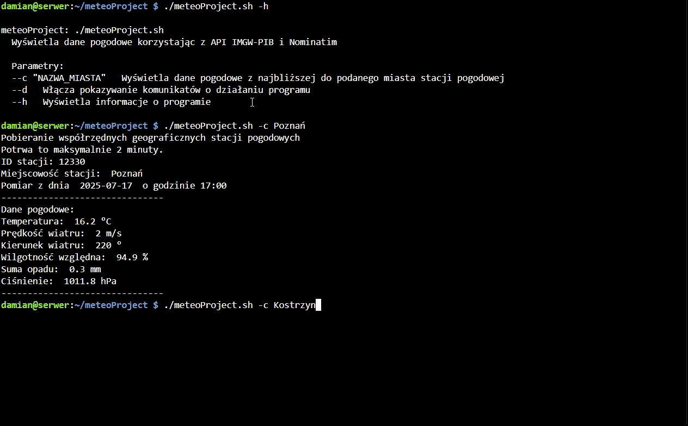

# Bash and Powershell Weather App (EN)

_This description is an automatic translation of the Polish version below._



## Project Description

Bash and Powershell Weather App is a command-line app for retrieving and displaying current weather data for Polish cities. The application uses public APIs (IMGW-PIB for weather data and Nominatim for geolocation) and is available in both Bash (Linux/macOS) and PowerShell (Windows) versions. The tool allows you to check the weather for any city and displays information from the nearest weather station.

The project demonstrates practical use of shell scripting, working with JSON data, and integrating with external APIs.

## Main Features

- Fetches current weather data from all IMGW-PIB weather stations in Poland.
- Finds the nearest weather station based on city coordinates.
- Displays temperature, wind speed and direction, humidity, rainfall, and pressure.
- Caches downloaded data to speed up subsequent queries.
- Debug mode for detailed operation logs.

## Application Components

### 1. Data Download and Caching

- Downloads weather data from the IMGW-PIB API.
- Caches data locally to avoid unnecessary API calls.
- Downloads and caches city geolocation data using the Nominatim API.

### 2. Nearest Station Search and Weather Display

- Calculates the distance between the input city and all weather stations.
- Selects the station with the smallest distance for weather display.
- Displays measurement time, temperature, wind, humidity, rainfall, and pressure.

### 3. Command-Line Interface

- Parameters:
  - `-c "CITY_NAME"` – show weather for the nearest station to the given city
  - `-d` – enable debug messages
  - `-h` – show help

## Technologies and APIs

- Bash (for Linux/macOS)
- PowerShell (for Windows)
- curl, jq, bc (for Bash version)
- Public APIs: IMGW-PIB, Nominatim

## How to Run

### Bash (Linux/macOS)

1. Make sure you have `curl`, `jq`, and `bc` installed.
2. Run:
   ```
   ./meteoProject.sh -c "Warszawa"
   ```

### PowerShell (Windows)

1. Run:
   ```
   .\meteoProject.ps1 -c "Warszawa"
   ```

<br>

# Aplikacja pogodowa w Bash i Powershell (PL)

## Opis projektu

Aplikacja pogodowa w Bash i Powershell to konsolowa aplikacja do pobierania i wyświetlania aktualnych danych pogodowych dla polskich miast. Aplikacja korzysta z publicznych API (IMGW-PIB do danych pogodowych oraz Nominatim do geolokalizacji) i dostępna jest zarówno w wersji Bash (Linux/macOS), jak i PowerShell (Windows). Pozwala sprawdzić pogodę wpisując dane dowolnego miasta w Polsce i wyświetla dane z najbliższej stacji pogodowej.

Projekt obejmuje praktyczne wykorzystanie skryptów powłoki, pracę z danymi JSON oraz integracje z zewnętrznymi API.

## Główne funkcje

- Pobieranie aktualnych danych pogodowych ze wszystkich stacji IMGW-PIB w Polsce.
- Wyszukiwanie najbliższej stacji pogodowej na podstawie współrzędnych miasta.
- Wyświetlanie temperatury, prędkości i kierunku wiatru, wilgotności, opadów i ciśnienia.
- Cachowanie pobranych danych dla przyspieszenia kolejnych zapytań.
- Tryb debugowania z dodatkowymi komunikatami.

## Elementy aplikacji

### 1. Pobieranie i buforowanie danych

- Pobieranie danych pogodowych z API IMGW-PIB.
- Cachowanie danych lokalnie, aby ograniczyć liczbę zapytań do API.
- Pobieranie i cachowanie współrzędnych miast przez API Nominatim.

### 2. Wyszukiwanie najbliższej stacji i wyświetlanie pogody

- Obliczanie odległości między wprowadzonym miastem a wszystkimi stacjami pogodowymi.
- Wybór stacji o najmniejszej odległości do prezentacji pogody.
- Wyświetlanie czasu pomiaru, temperatury, wiatru, wilgotności, opadów i ciśnienia.

### 3. Interfejs wiersza poleceń

- Parametry:
  - `-c "NAZWA_MIASTA"` – pokazuje pogodę z najbliższej stacji do podanego miasta
  - `-d` – włącza komunikaty debugowania
  - `-h` – wyświetla pomoc

## Technologie i API

- Bash (dla Linux/macOS)
- PowerShell (dla Windows)
- curl, jq, bc (dla wersji Bash)
- Publiczne API: IMGW-PIB, Nominatim

## Uruchomienie

### Bash (Linux/macOS)

1. Upewnij się, że masz zainstalowane `curl`, `jq` i `bc`.
2. Uruchom:
   ```
   ./meteoProject.sh -c "Warszawa"
   ```

### PowerShell (Windows)

1. Uruchom:
   ```
   .\meteoProject.ps1 -c "Warszawa"
   ```

<br>
